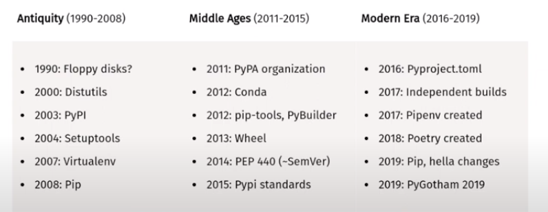

# Python Distributions

[A][1] package distribution can be defined as the collection of files that together allows to build, package and distribute a module. Once a distribution exists in a system, it can easily be installed. Also, it can be shared with PyPI(Python package index) community so that other people can use your distribution.

[There are][3] two types of [distributions][2]:

- **Source Distribution (sdist)**: A source distributions is the simpler of the two types of distributions. Intuitively speaking, an sdist is very similar to source code - the code that you write. Therefore, sdist will not include platform-specific binaries. The result is an archive (.tar.gz) that contains the source code of your package and instructions on how to build it, and the target system of your client will perform the actual build to create a bdist (wheel).

  Creating an sdist is akin to sharing just the source. It doesn't build usable artifacts that the client can consume immediately. The advantage of this is that creating an sdist is the same for all platforms (Windows, Linux, Mac) and machines (32 Bit / 64 Bit). The disadvantage is that users have to build the package themselves once they download the sdist.

- **Built Distribution (bdist)**: It creates distribution which includes .pyc files(python bytecode), .so/.dll/.dylib for binary modules, .exe if using [pyinstaller](https://pyinstaller.org/en/stable/) on Windows, data files… but no `setup.py`. The result is an archive that is specific to a platform (for example linux-x86_64) and to a version of Python. That can be installed and then used directly by extracting it into the root of your filesystem (executables are in `/usr/bin` (or equivalent), data files in `/usr/share`, modules in `/usr/lib/pythonX.X/site-packages/…`).

# Dependency managment, Packaging (AKA publishing), and virtual environments

## Definitions

- **[Python](https://youtu.be/QX_Nhu1zhlg?t=401) dependency managment**: the process of installing, operating, configuring, and removing Python distributions used by your project in a consistent manner.

> NOTE: [An](https://www.youtube.com/watch?v=QX_Nhu1zhlg&t=193s) example of how not having package manager can mess things up.

- **[Packaging](https://youtu.be/QX_Nhu1zhlg?t=433)**: the process of creating and uploading a Python distribution to be used by yourself and others.
- **Virtual environments**:

## History

## Conclusions

The utimate conclusion is:
- We have a trillion tools that is intended to solve these three issues.
- All of them but Poetry is a pain in the ass. So stick with Poetry.
- Honorable mentions to
  - `setuptools`, which had been became a standard tool for building up a Python distribution. Nowadays, it may be consedered obsolete by some, though;
  - `PyPI` (Python Package Index), as it has become the official third-party software repository for Python. However, it has nothing to do with the package dependency, packaging, and creating virtual environments;
  - `pip` as it has bemoce the default package manager to install packages from PyPI or elsewhere.
 
## Advantage of Poetry over the other tools

- It wonderfully does the script install which was usually done by `setuptools` and `setup.py`.

### setuptools

TODO:

https://stackoverflow.com/questions/77664095/what-are-the-differences-between-pipx-and-pip-user

https://trello.com/c/66EaMW4j/86-general-knowledge-except-errors-and-warnings-pkg-mng-and-virtenv-packaging

https://dev.to/bowmanjd/python-tools-for-managing-virtual-environments-3bko

https://dev.to/bowmanjd/how-do-i-install-a-python-command-line-tool-or-script-hint-pipx-3i2

https://www.reddit.com/r/learnpython/comments/jq5miv/pip_vs_pipx/

https://github.com/pypa/pipx

https://stackoverflow.com/questions/59286983/how-to-run-a-script-using-pyproject-toml-settings-and-poetry

https://ericmjl.github.io/blog/2016/12/24/how-to-make-your-python-scripts-callable-from-the-command-line/

https://stackoverflow.com/questions/3701646/how-to-add-to-the-pythonpath-in-windows-so-it-finds-my-modules-packages

[1]: https://www.geeksforgeeks.org/source-distribution-and-built-distribution-in-python/
[2]: https://youtu.be/QX_Nhu1zhlg?t=352&si=OOcG9cDoCnnzCYBE
[3]: https://dev.to/icncsx/python-packaging-sdist-vs-bdist-5ekb
